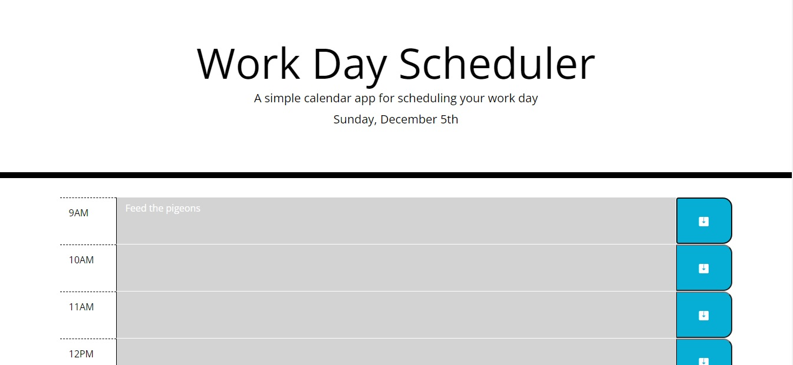

# Work Day Scheduler

[Live App](https://ddoherty6.github.io/05-Work-Day-Scheduler/)

Work Day Scheduler is a web application for scheduling your day. A simple interface allows you to schedule events for each hour for the workday.

## Development

Importing jQuery, Bootstrap, Bootstrap Icons, Font Awesome and Google fonts. 

Initial development concerned how to structure the HTML. As it is a daily scheduler, and any expansion would most likely require dynamically updating the page to display the schedule for a new day, all of the article elements, which carry the function of the application, were chosen to be hard coded as opposed to dynamically generated in Javascript. Dynamic HTML elements would better suit a scheduler that supports scrolling down to add to new dynamically generated timeslots. But then it would not be Day Scheduler. It would just be Scheduler. Company would have to rebrand. But they shouldn't, because I would have to rewrite this entire app.

Javascript is broken into two objects. setColors contains methods to display colors on the page. It also has methods for keeping the time. These methods are linked to update the colors on the page at the top of every hour. apptStorage reacts to a click event and saves events to localStorage. It also loads events from localStorage when the page is loaded.

## Expandability

To expand on this app, user could have the option to change the day displayed on the app. Only changes are to the date displayed on the page, and the way key/value pairs are written to localStorage. Making the keys unique all-time, perhaps by concatonating the date and id of the article element.

## Conclusion

Looking again, I could have made better use of Moment.js. I was focused on the logics, and forgot to consult the entire API to see how else it could help me. Bootstrap and jQuery were well-utilized. Overall though it was a satisfying project.